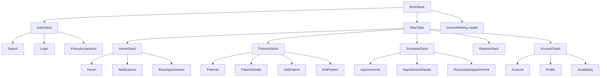

# Simplify screen navigation

Today every screen sits on one native stack in [`src/navigation/AppNavigator.tsx`](src/navigation/AppNavigator.tsx): Splash, Login, the five “tabs”, and every detail flow. The bottom bar in [`src/components/commons/CustomBottomBar/CustomBottomBar.tsx`](src/components/commons/CustomBottomBar/CustomBottomBar.tsx) is not a tab navigator. It calls `navigate()` between stack routes, so Home, Patients, Schedule, Reports, and Account pile up and Back walks across tabs.

Video calls add a second layer: [`MeetingSessionHost`](src/components/meeting/MeetingSessionHost.tsx) in [`App.tsx`](App.tsx) draws the call, while the stack route `DoctorMeeting` is an empty shell. Route names in [`src/route/index.ts`](src/route/index.ts) also describe screens that are not registered.

Keep the current bottom-bar look. Wire it to `createBottomTabNavigator` so a tab press switches tabs and does not push another screen.

## Target structure

**Root stack** (only three slots):

- `Auth` — nested stack: `Splash`, `Login`, `PolicyAcceptance`. Login and logout `reset` to this or to `Main`.
- `Main` — bottom tabs. Each tab owns a small stack so Back stays inside that tab.
- `DoctorMeeting` — one full-screen modal on the root, presented only while a call is the focused UI. PiP still uses [`MeetingSessionHost`](src/components/meeting/MeetingSessionHost.tsx) and `useMeetingStore`; the route is no longer a second copy of the call UI.

**Tab stacks** (screens that exist today):

- Home: `Home`, `Notifications`, `BookAppointment`, `Invoices`, `Prescription`, `ViewPrescription`, `CreatePrescription` when opened from Home.
- Patients: `Patients`, `PatientDetails`, `AddPatient`, `EditPatient`, and prescription screens when opened from a patient.
- Schedule: `Appointments`, `AppointmentDetails`, `RescheduleAppointment`, prescription screens when opened from an appointment.
- Reports: `Reports` (still the coming-soon screen).
- Account: `Account` (settings), `Profile`, `Availability`.

Shared flows (`CreatePrescription`, `ViewPrescription`) stay one component. They are registered on each stack that can open them, or on a single root modal group if registering them three times is awkward. Prefer one root modal group for Book / Reschedule / Create prescription / View prescription so those wizards do not get copied into three stacks.

## Phase 1 — One name per screen

In [`src/route/index.ts`](src/route/index.ts), keep only names that `AppNavigator` actually renders. Delete or stop navigating to ghosts: `MainTabs`, `Schedule`, `DoctorAppointments`, `PrescriptionList`, `PrescriptionView`, `PrescriptionSettings`, `InvoiceSettings`, `InvoiceList`, `CreateInvoice`.

Canonical names (already registered):

- List: `Prescription` (drop `PrescriptionList`)
- Detail: `ViewPrescription` (drop `PrescriptionView`)
- Schedule tab: `Appointments` (drop `DoctorAppointments` and `Schedule`)

Update every `navigate` / `replace` / `reset` that still uses the old strings, especially:

- [`CreatePrescriptionScreen.tsx`](src/Features/Dashboard/PrescriptionScreen/CreatePrescriptionScreen.tsx) back paths
- [`notificationModal.utils.ts`](src/lib/commons/notificationModal.utils.ts) (`PrescriptionView` + `prescriptionId` must become `ViewPrescription` + `rxId`)
- [`CustomBottomBar.tsx`](src/components/commons/CustomBottomBar/CustomBottomBar.tsx) `MainTabs` / `Schedule` / `DoctorAppointments` branches
- [`navigation.utils.ts`](src/lib/commons/navigation.utils.ts) `resetToMainTabs` (rename to reset to the authenticated root)

Align params: `AppointmentDetails` must include `isComingFromNotification`. Remove `(navigation as any)` on these call sites so TypeScript catches a bad name.

Settings items that navigate to `PrescriptionSettings` and `InvoiceSettings` should open an in-screen coming-soon state or a real screen. They must not call `navigate` to an unregistered route.

## Phase 2 — Auth stack and tab shell

Split [`AppNavigator.tsx`](src/navigation/AppNavigator.tsx):

- `AuthStack` for Splash, Login, Policy.
- `MainTabs` with five tabs. Hide the default React Navigation tab bar. Keep [`CustomBottomBar`](src/components/commons/CustomBottomBar/CustomBottomBar.tsx) and change its press handler to `navigation.navigate('Main', { screen: tab })` (or the tab navigator’s `jumpTo`). Remove `StackActions.replace` between tab roots.
- Each tab gets `createNativeStackNavigator` for its detail screens.
- Splash, login success, policy accept, and logout keep using reset helpers, but the authenticated reset target becomes `Main` with the Home tab, not a lone `Home` route on the same stack as Login.

[`SafeAreaWrapper`](src/Layout/SafeAreaWrapper.tsx) shows the bottom bar only on tab roots. Detail screens hide it the same way they do now.

## Phase 3 — Meeting is one session, one route

Do not fold the call into a tab. Leave [`MeetingSessionHost`](src/components/meeting/MeetingSessionHost.tsx) as the VideoSDK owner so PiP can float over the app.

- Join from [`AppointmentScreen.tsx`](src/Features/Dashboard/AppointmentScreen/AppointmentScreen.tsx) sets the meeting store, then opens root `DoctorMeeting` as a modal.
- Leaving the full-screen call enters in-app PiP and dismisses the modal. The call stays alive in the store and host.
- [`useMeetingPip.ts`](src/hooks/commons/meeting/useMeetingPip.ts) and Android PiP restore open that same modal only when the user returns to the full call. They must not `navigate(DoctorMeeting)` on every focus change while the user is browsing Patients.
- [`DoctorMeetingScreen.tsx`](src/Features/Dashboard/MeetingScreen/DoctorMeetingScreen.tsx) `beforeRemove` should either block the pop and enter PiP, or allow the pop after PiP is set. It should not `preventDefault` and then dispatch the same pop.
- Socket end-of-call and the offline emergency exit clear the store and dismiss `DoctorMeeting` before they `replace` to `AppointmentDetails` or `Home`.

## Phase 4 — Back and notifications

- Inside a tab, Back uses `goBack()`.
- If a screen was opened from a notification and the stack cannot go back, reset to `Main` / Home. Keep the pattern already in [`AppointmentDetailsScreen.tsx`](src/Features/Dashboard/AppointmentScreen/AppointmentDetailsScreen.tsx).
- Either wire `pendingRoute` in [`navigation.utils.ts`](src/lib/commons/navigation.utils.ts) from the notification open handler before Splash finishes, or remove `consumeTargetRoute` so Splash does not pretend to restore a target it never stored.
- No React Navigation `linking` config in this pass. Notification taps stay in-app once the name and param bugs are fixed.

## Files to change

- [`src/navigation/AppNavigator.tsx`](src/navigation/AppNavigator.tsx) — split stacks and tabs
- [`src/route/index.ts`](src/route/index.ts) — param lists match real screens
- [`src/navigation/navigationRef.ts`](src/navigation/navigationRef.ts) and [`src/lib/commons/navigation.utils.ts`](src/lib/commons/navigation.utils.ts) — reset helpers target `Main`
- [`src/components/commons/CustomBottomBar/CustomBottomBar.tsx`](src/components/commons/CustomBottomBar/CustomBottomBar.tsx) — tab jump, drop legacy route names
- Call sites listed in Phase 1, plus Splash, Login, Policy, Settings logout, BookAppointment success reset
- Meeting: `DoctorMeetingScreen`, `useMeetingPip`, `MeetingController`, `SocketListeners`, `GlobalNoInternetBlocker`

## Out of scope

- Redesigning the bottom bar visuals
- Building Reports, Invoices, or settings sub-screens that are still coming soon
- Deep links / universal links
- Moving patient detail’s internal tabs (profile, records, prescriptions) into React Navigation; those stay local state

## Major loopholes

- **Ghost routes.** Code navigates to `PrescriptionView`, `PrescriptionList`, `DoctorAppointments`, `PrescriptionSettings`, and `InvoiceSettings`. Those screens are not on the stack, so those taps fail or no-op. Notifications pass `prescriptionId` while the screen reads `rxId`.
- **Tabs are a stack.** Switching tabs pushes screens. Back leaves Schedule and lands on Patients or Home. Only some screens use `replace` or `reset`.
- **No auth boundary.** Login and Home share one navigator. Nothing stops a `navigate('Home')` while logged out except Splash, logout, and the policy hook.
- **Two meeting owners.** The store and `MeetingSessionHost` keep the call alive after `DoctorMeeting` pops. PiP hooks push `DoctorMeeting` again while the user is on another screen. `beforeRemove` both blocks and applies the pop.
- **Policy redirect can interrupt a flow.** [`useAuthProfile`](src/hooks) replaces the current route with `PolicyAcceptance` on any screen when policies are false.
- **Cold-start notifications do nothing.** `pendingRoute` is never set. `consumeTargetRoute()` always returns Home.
- **Types lie.** `RootStackParamList` includes screens that are not registered, and many screens use `useNavigation()` without that list, so TypeScript does not catch bad navigations.
- **Book appointment wipes history.** Success resets the whole stack to a single `Appointments` route, which drops Home underneath. Other success paths push instead. Behavior is inconsistent.
- **Offline and socket navigation bypass the screen.** The no-internet blocker and socket listener call `navigationRef` directly (`Home`, `AppointmentDetails`) without coordinating with the meeting modal.
