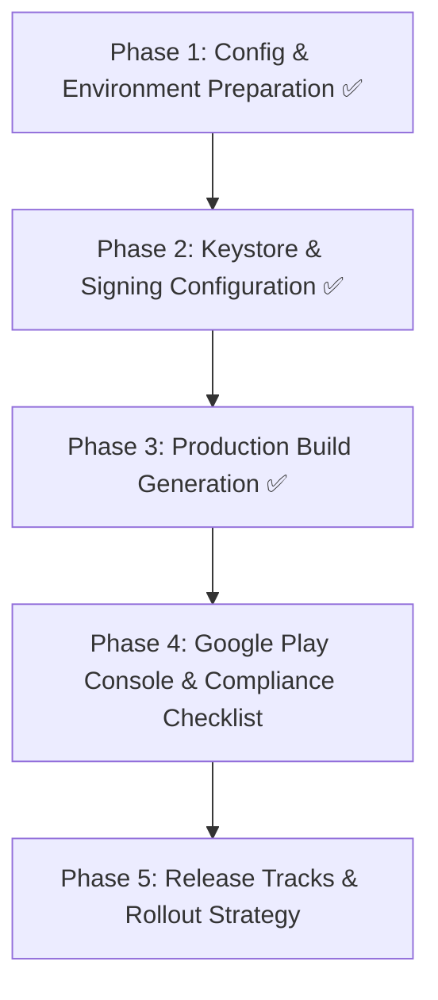
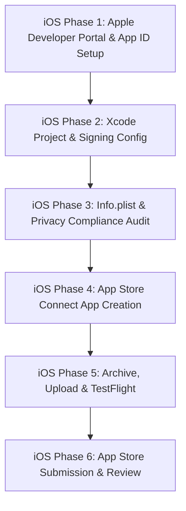

# PRED Doctor — Mobile Production Release & App Store Publishing Plan

This document outlines the complete roadmap for generating production keys, configuring signing, producing release artifacts, and publishing **PRED Doctor** (`com.predcaredoctor`) to both the **Google Play Store (Android)** and the **Apple App Store (iOS)**.

---

# Part I: Android Production Release (Google Play Store)

## Android Architecture & Workflow Overview



---

## Phase 1: Configuration & Environment Setup ✅ [COMPLETED]

1. **Verify App Identity & Versioning** [COMPLETED]
   - **App ID**: `com.predcaredoctor` in `android/app/build.gradle` ✅
   - **Display Name**: `PRED Doctor` in `android/app/src/main/res/values/strings.xml` and `app.json` ✅
   - **Version Settings** (in `android/app/build.gradle` & `package.json`):
     - `versionCode 2` (incremented from 1) ✅
     - `versionName "1.0.1"` ✅
     > *Note: For every subsequent Play Store upload, `versionCode` must increment by +1.*

2. **Permissions & Play Store Compliance Audit** [COMPLETED]
   - Audited permissions in `android/app/src/main/AndroidManifest.xml`:
     - `RECORD_AUDIO` & `CAMERA`: Retained for teleconsultation & document capture ✅
     - `SYSTEM_ALERT_WINDOW`: Moved to `android/app/src/debug/AndroidManifest.xml` so production release does not trigger Google Play overlay justifications while debug keeps dev menu functionality ✅
     - `com.google.android.gms.permission.AD_ID`: Removed from production manifest to avoid unnecessary ad policy disclosures ✅
     - `ACCESS_FINE_LOCATION` & `ACCESS_COARSE_LOCATION`: Retained for doctor clinic location features ✅

---

## Phase 2: Keystore Generation & Signing Setup ✅ [COMPLETED]

### 2.1 Generate Release Keystore (`.keystore` / `.jks`) [COMPLETED]
Generated release keystore files: `android/app/predcare-doctor-release.jks` and `android/app/predcare-doctor-release.keystore` ✅
```bash
cd android/app
keytool -genkeypair -v -storetype PKCS12 -keystore predcare-doctor-release.jks -alias predcare-doctor -keyalg RSA -keysize 2048 -validity 10000 -storepass 'Pred@321$' -keypass 'Pred@321$' -dname "CN=PRED Doctor, OU=Engineering, O=PredCare, L=Bangalore, ST=Karnataka, C=IN"
```
> [!IMPORTANT]
> Store the generated keystore file and passwords in a secure password manager. Losing this key prevents updating the app on Google Play.

### 2.2 Configure Credentials in `android/gradle.properties` [COMPLETED]
Added signing variables to `android/gradle.properties` ✅:
```properties
PREDCARE_UPLOAD_STORE_FILE=predcare-doctor-release.jks
PREDCARE_UPLOAD_KEY_ALIAS=predcare-doctor
PREDCARE_UPLOAD_STORE_PASSWORD=Pred@321$
PREDCARE_UPLOAD_KEY_PASSWORD=Pred@321$
```

### 2.3 Protect Keys in `.gitignore` [COMPLETED]
Updated `.gitignore` to ensure private keys and keystores remain uncommitted ✅:
```gitignore
*.keystore
*.jks
!debug.keystore
```

### 2.4 Update `android/app/build.gradle` [COMPLETED]
Configured `release` signing config and assigned to `buildTypes.release` ✅:
```groovy
signingConfigs {
    debug {
        storeFile file('debug.keystore')
        storePassword 'android'
        keyAlias 'androiddebugkey'
        keyPassword 'android'
    }
    release {
        if (project.hasProperty('PREDCARE_UPLOAD_STORE_FILE')) {
            storeFile file(PREDCARE_UPLOAD_STORE_FILE)
            storePassword PREDCARE_UPLOAD_STORE_PASSWORD
            keyAlias PREDCARE_UPLOAD_KEY_ALIAS
            keyPassword PREDCARE_UPLOAD_KEY_PASSWORD
        }
    }
}
buildTypes {
    debug {
        signingConfig signingConfigs.debug
    }
    release {
        signingConfig signingConfigs.release
        minifyEnabled enableProguardInReleaseBuilds
        proguardFiles getDefaultProguardFile("proguard-android-optimize.txt"), "proguard-rules.pro"
    }
}
```

---

## Phase 3: Production Build Generation ✅ [COMPLETED]

### 3.1 Build Android App Bundle (`.aab`) — For Google Play Store [COMPLETED]
Build succeeded and signed with release keystore ✅
- **Output Artifact**: `android/app/build/outputs/bundle/release/app-release.aab`
- **File Size**: ~54.9 MB
- **Signature Check**: Verified with `keytool` (Signer: `CN=PRED Doctor, OU=Engineering, O=PredCare, L=Bangalore, ST=Karnataka, C=IN`, SHA-256 fingerprint verified)

### 3.2 Build Release APK (`.apk`) — For Local Device Testing [SKIPPED AS OF NOW]
*(Can be generated later whenever needed using `./gradlew assembleRelease`)*

---

## Phase 4: Google Play Console Listing & Compliance

| Item | Requirement / Details |
| :--- | :--- |
| **Developer Account** | Google Play Console registration ($25 one-time fee) |
| **App Title** | `PRED Doctor` (Max 30 characters) |
| **Short Description** | Concise summary of doctor consultations and EMR management (max 80 chars) |
| **Full Description** | Full feature list (teleconsultation, patient records, digital prescriptions) |
| **App Icon** | 512 × 512 px PNG (32-bit color, max 1024 KB) |
| **Feature Graphic** | 1024 × 500 px JPG/PNG |
| **Phone Screenshots** | At least 2 phone screenshots (16:9 or 9:16 aspect ratio, max 8MB each) |
| **Tablet Screenshots** | Recommended if doctors use tablets/iPads |
| **Privacy Policy URL** | Live HTTPS link covering health/EMR data, camera/audio access, doctor data |
| **Data Safety Questionnaire**| Declarations for health records, personal info, audio/video data, data encryption in transit |
| **Reviewer Credentials** | Active test doctor mobile number and OTP/credentials for Google testers |

---

## Phase 5: Release Tracks & Rollout Strategy

1. **Internal Testing Track**:
   - Upload `app-release.aab` to internal testers (up to 100 internal emails).
   - Instant availability (no Google review required).
2. **Closed Testing Track**:
   - For new personal developer accounts created after Nov 2023, Google requires at least 20 testers opted-in for 14 continuous days.
   - For organization/company accounts, closed testing can proceed directly without the 14-day rule.
3. **Production Track**:
   - Promote tested build to Production.
   - Initial review typically takes 24–72 hours.

---

# Part II: iOS Production Release & App Store Publishing Plan

This section provides the end-to-end roadmap for configuring certificates, creating Apple identifiers, archiving the build, uploading to TestFlight, and submitting **PRED Doctor** to the Apple App Store.

---

## iOS Architecture & Workflow Overview



---

## iOS Phase 1: Apple Developer Portal & App Identifier Setup

### 1.1 Sign in to Apple Developer Account
- Go to [developer.apple.com/account](https://developer.apple.com/account).
- Ensure your Apple Developer membership is active (Annual $99 fee).

### 1.2 Register App ID (Bundle Identifier)
1. Navigate to **Certificates, Identifiers & Profiles** $\rightarrow$ **Identifiers** $\rightarrow$ Click **`+`** (Register a new identifier).
2. Select **App IDs** $\rightarrow$ Click **Continue**.
3. Select type **App** $\rightarrow$ Click **Continue**.
4. Configure App ID:
   - **Description**: `PRED Doctor`
   - **Bundle ID**: Select **Explicit** and enter `com.predcaredoctor` *(matching your Android applicationId)*.
5. Enable Required Capabilities:
   - **Push Notifications** (for doctor appointment alerts and call notifications).
   - **Associated Domains** (if universal links / deep linking are used).
   - **Background Modes**.
6. Click **Continue** $\rightarrow$ Click **Register**.

### 1.3 Distribution Certificate & Provisioning Setup
- **Option A (Recommended — Automatic Signing)**:
  Xcode can automatically generate and manage your Apple Distribution Certificate and App Store Provisioning Profile when you log in with your Apple ID.
- **Option B (Manual Signing)**:
  1. Generate an **Apple Distribution Certificate** in Developer Portal using a Certificate Signing Request (CSR) from macOS Keychain Access.
  2. Create an **App Store Provisioning Profile** tied to `com.predcaredoctor` and your Distribution Certificate.
  3. Download and double-click to install into Xcode.

---

## iOS Phase 2: Xcode Project & Signing Configuration

### 2.1 Update Bundle Identifier & Project Settings
In `ios/predcaredoctor.xcodeproj/project.pbxproj`:
- Change `PRODUCT_BUNDLE_IDENTIFIER` from placeholder `org.reactjs.native.example.$(PRODUCT_NAME:rfc1034identifier)` to:
  ```
  PRODUCT_BUNDLE_IDENTIFIER = com.predcaredoctor;
  ```
- Set `MARKETING_VERSION = 1.0.0;`
- Set `CURRENT_PROJECT_VERSION = 1;`

### 2.2 Configure Team & Code Signing in Xcode
1. Open the workspace in Xcode:
   ```bash
   cd ios && open predcaredoctor.xcworkspace
   ```
2. Select the top-level **predcaredoctor** project in the left navigator.
3. Select the **predcaredoctor** target $\rightarrow$ Go to the **Signing & Capabilities** tab.
4. Check **Automatically manage signing**.
5. Select your organization's **Team** from the dropdown.
6. Verify Bundle Identifier displays: `com.predcaredoctor`.
7. Verify Provisioning Profile displays: `Xcode Managed Profile` without any red signing errors.

---

## iOS Phase 3: Info.plist, Privacy Manifest & Policy Compliance Audit

### 3.1 Audit `UIBackgroundModes` in `ios/predcaredoctor/Info.plist`
Currently configured background modes:
```xml
<key>UIBackgroundModes</key>
<array>
    <string>audio</string>
    <string>voip</string>
    <string>remote-notification</string>
</array>
```
> [!CAUTION]
> **Remove `<string>voip</string>`** if the app does not integrate Apple's native PushKit and CallKit framework. Apple's automated ingest rejects apps declaring VoIP background mode without CallKit implementation (App Store Review Guideline 2.5.4).
> Keep `<string>audio</string>` and `<string>remote-notification</string>`.

### 3.2 Audit Privacy Descriptions (Usage Strings)
Verify the permission descriptions in `ios/predcaredoctor/Info.plist`:
- `NSCameraUsageDescription`: *"PRED Doctor needs camera access to capture patient profile photos and EMR documents."* ✅
- `NSMicrophoneUsageDescription`: *"PRED Doctor needs microphone access for teleconsultation audio and video calls."* ✅
- `NSPhotoLibraryUsageDescription`: *"PRED Doctor needs access to your photos to upload patient records and documents."* ✅
- `NSPhotoLibraryAddUsageDescription`: *"PRED Doctor needs permission to save medical records and reports to your photos."* ✅
- `NSBluetoothAlwaysUsageDescription`: *"PRED Doctor uses Bluetooth to connect wireless headsets during consultations."* ✅
- `NSLocationWhenInUseUsageDescription`: *"PRED Doctor requires location access to find nearby clinics and emergency services."* ✅

### 3.3 Verify Privacy Manifest (`PrivacyInfo.xcprivacy`)
Apple enforces privacy manifests for iOS apps:
- File location: `ios/predcaredoctor/PrivacyInfo.xcprivacy` ✅
- Declares required reason APIs: `UserDefaults`, `FileTimestamp`, and `SystemBootTime`.
- Declares `NSPrivacyTracking = false` (no cross-app tracking).

---

## iOS Phase 4: App Store Connect App Registration

1. Go to [appstoreconnect.apple.com](https://appstoreconnect.apple.com) $\rightarrow$ Navigate to **Apps**.
2. Click the **`+`** icon $\rightarrow$ Select **New App**.
3. Fill out the New App dialog:
   - **Platforms**: iOS
   - **Name**: `PRED Doctor`
   - **Primary Language**: English (US)
   - **Bundle ID**: Select `com.predcaredoctor` (created in Phase 1)
   - **SKU**: `predcare-doctor-ios`
   - **User Access**: Full Access
4. Click **Create**.

---

## iOS Phase 5: Building Archive, Uploading & TestFlight

### 5.1 CocoaPods Dependencies Verification
Ensure all pods are cleanly installed before building:
```bash
cd ios
bundle exec pod install
```

### 5.2 Build Release Archive
**Method 1: Via Xcode GUI (Recommended)**
1. Open `ios/predcaredoctor.xcworkspace` in Xcode.
2. In the top toolbar, select destination device: **Any iOS Device (arm64)**.
3. In the menu bar, click **Product** $\rightarrow$ **Clean Build Folder** (`Cmd + Shift + K`).
4. In the menu bar, click **Product** $\rightarrow$ **Archive**.
5. Wait for the archive process to complete. Xcode's **Organizer** window will automatically pop up.

**Method 2: Via Terminal CLI**
```bash
cd ios
xcodebuild clean archive \
  -workspace predcaredoctor.xcworkspace \
  -scheme predcaredoctor \
  -configuration Release \
  -destination 'generic/platform=iOS' \
  -archivePath build/predcaredoctor.xcarchive
```

### 5.3 Upload Build to App Store Connect
1. In Xcode Organizer, select the latest archive under **predcaredoctor**.
2. Click **Distribute App** (blue button on right).
3. Select **App Store Connect** $\rightarrow$ Click **Next**.
4. Select destination: **Upload** $\rightarrow$ Click **Next**.
5. Keep default distribution options (Upload app's symbols, strip Swift symbols) $\rightarrow$ Click **Next**.
6. Select **Automatically manage signing** $\rightarrow$ Click **Next**.
7. Review build summary $\rightarrow$ Click **Upload**.
8. Wait for "Upload Successful" screen.

*(Alternative: Export `.ipa` and upload using the macOS **Transporter** app).*

---

## iOS Phase 6: App Store Listing & Review Submission

### 6.1 TestFlight Internal & External Testing
1. Once uploaded, Apple takes ~10–20 minutes to process the build.
2. In App Store Connect $\rightarrow$ Go to the **TestFlight** tab.
3. If prompted for "Export Compliance Information" (encryption):
   - Answer **No** if using standard HTTPS/SSL axios network requests.
4. Add internal testers (doctor team) for instant testing via the TestFlight iOS app.

### 6.2 App Store Listing Metadata Checklist
| Item | Requirement / Details |
| :--- | :--- |
| **App Title** | `PRED Doctor` (Max 30 characters) |
| **Subtitle** | Concise tagline for doctor teleconsultation (Max 30 chars) |
| **App Icon** | 1024 × 1024 px PNG (No transparency/alpha channel) |
| **Screenshots (6.9" / 6.7")** | Required: 1320 × 2868 px or 1290 × 2796 px (iPhone 16 Pro Max / 15 Pro Max) |
| **Screenshots (6.5" / 5.5")** | Recommended: 1242 × 2688 px or 1242 × 2208 px |
| **iPad Screenshots** | 2048 × 2732 px (if iPad support is enabled) |
| **Promotional Text** | Optional highlight (Max 170 chars) |
| **Description** | Full feature list (teleconsultation, patient records, digital prescriptions) |
| **Keywords** | Comma-separated search keywords (Max 100 chars, e.g. `doctor,telemedicine,clinic,emr,prescriptions,health`) |
| **Support URL** | HTTPS link to your support page (e.g. `https://predcare.com/support`) |
| **Marketing URL** | HTTPS link to your website |
| **Privacy Policy URL** | Live HTTPS privacy policy link |
| **Age Rating** | Complete questionnaire (typically 12+ or 17+ for medical/health apps) |

### 6.3 App Review Contact & Credentials (Mandatory)
In App Store Connect $\rightarrow$ **App Review Information**:
- **Sign-in required**: Checked.
- **Username**: Active test doctor mobile number / email.
- **Password / OTP**: Active test credentials for the Apple reviewer.
- **Review Notes**: Explain that the app requires camera and microphone permissions solely for doctor-patient video consultations and attaching medical records.
- **Contact Information**: Developer / team contact email & phone number.

### 6.4 Submit for Review
Click **Add for Review** $\rightarrow$ **Submit to App Review**.
Initial Apple App Store review typically takes **24 to 48 hours**.
